  

  
  &nbsp;
  
  &nbsp;
  

 

# Hi, I'm Huy Hoàng! ✌️
> *Coding is more than a skill—it's my passion and my job. 🚀*

 

## 🌟 Giới thiệu nhanh

**Fresher Full-Stack Developer** tập trung vào Java Spring Boot và React, đam mê xây dựng các ứng dụng web hiệu quả và có khả năng mở rộng. 

- 🛠 Hiện đang xây dựng: **Fullstack web apps, REST APIs & Microservices**
- 🌱 Đang học: **Microservices architecture, AWS**
- 💡 Thế mạnh: **Clean code, System design, DSA**
- 🏐 Đam mê: **Code dạo và đánh Bóng chuyền** 

 

## 💻 Ngôn ngữ & Công nghệ

  

 

## 🏆 GitHub Trophies

   &nbsp;  &nbsp; 

 

## 📊 GitHub Stats

  
  

 

  

 

## 📈 Activity Graph

  

 

## 🐍 Contribution Snake (Rắn ăn điểm đóng góp)

  <picture>
    <source media="(prefers-color-scheme: dark)" srcset="https://raw.githubusercontent.com/HuyHoang1233/HuyHoang1233/output/github-contribution-grid-snake-dark.svg">
    <source media="(prefers-color-scheme: light)" srcset="https://raw.githubusercontent.com/HuyHoang1233/HuyHoang1233/output/github-contribution-grid-snake.svg">
    
  </picture>

